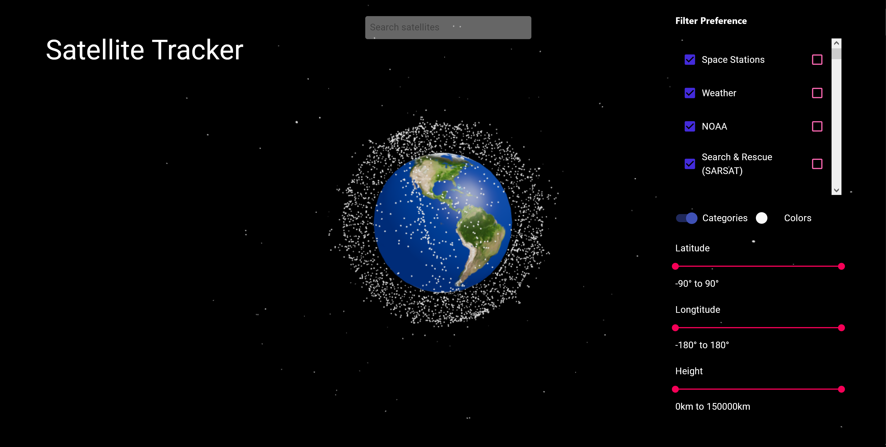

# 3D Satellite Tracker

Visualizes the estimated positions of active satellites. Built using [React](https://reactjs.org/), [Express](https://expressjs.com/), and [PostgreSQL](https://www.postgresql.org/). Data obtained from [Celestrak](http://www.celestrak.com/NORAD/elements), which updates satellite positional information daily.


Users can explore the 3D earth and observe the satellites movement in real time. Filters such as coordinates, height, and satellite type can be applied

Live Demo URL: 3d-satellite-tracker.netlify.app/



Individual satellites can be selected to view their path trajectory and additional information. Color can also be applied to differentiate satellite types.


## Running the project
Using docker:
```
$ git clone jeremysuh/3d-satellite-tracker
$ docker-compose up --build
```

- Fill in the enviromental variables in the docker-compose.yml file
- Rename the env.template file in both ./client and ./server to .env and fill them out accordingly

Running the front-end individiually: 
```
$ cd client
$ npm start
```

Running the back-end individiually: 
```
$ cd server
$ npx nodemon
```

